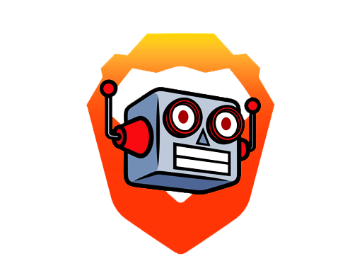

# Instagram Brave Bot
This is a Instagram unfollow/follow bot which uses Selenium to automate its functions, with the Brave Browser.

# Instructions
1. The script will first need dependencies, so navigate to the directory and using command prompt type:
- pip install -r requirements.txt
2. You may also have to install Microsoft Visual C++ 14.0, get it here:
- https://visualstudio.microsoft.com/downloads/
3. Usage: 
- python bot.py --follow
- python bot.py --unfollow
 
4. Finally, enter your driver path and brave path.
- https://chromedriver.chromium.org/downloads
- https://brave.com/

# Why did you make this?
I saw someone make a Chrome-version of this, however the entire process was bad. It stopped functioning the moment it encountered no follow buttons on the page for it to click. I also tried first to make Selenium scroll down bit by bit, but to make it easier, it would refresh after every tenth follow. One extra addition I made is that if you open a new browser with the bot-software, it will request you to accept cookies, and this implemented it to accept them. Be warned however, Instagram knows about stuff like this and they have put in procedures which block you from following or unfollowing anyone for a while if you abuse it. You do not get any other account restrictions though. If this happens, just wait a couple hours.

If you encounter any problems, try extending the sleep timer for the script. It might happen due to your internet loading too slow, and then Selenium can't catch up, or Instagram has updated the site and the script is broken.

Have fun.
